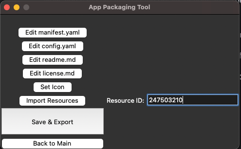

# App Packaging Tool

App Packaging Tool is a simple GUI tool that helps users with creating a new Sumo Apps.

It's main purpose is to make the app creation process easier and faster.

# Pre-requisites

Running the tool requires the following:
- Python 3.8 or higher
- Sumologic Terraform Provider
- Terraformer
- Any text editor (VS Code, Sublime, etc.)

Installing those can be done by following the steps below and is expected to take no longer than 20 minutes. If you run
into any issues, please try finding a solution online (ChatGPT can be super helpful) and if that didn't lead to success, please reach out to the Core-Platform Apps team:
`@mpreibisch` `@dlin` `@omid` 

### Python 3.8 or higher

In terminal, type `python3 --version` to check the version of Python installed on your machine. If it's lesser than
3.8, you can refer to online resources to upgrade your Python version. There are many tutorials and StackOverflow 
threads on that topic.

In case of Terraform(er) related issues, it's best to reach `@vishal` for help.

### Sumologic Terraform Provider

The tool uses Sumologic Terraform Provider to create the app. You can find the provider here:

https://github.com/SumoLogic/terraform-provider-sumologic/

Installation steps of the Sumologic Terraform Provider are listed in the README of that repository.

### Terraformer

Similarly, you will need to install Terraformer. You can find the installation guide here:

https://github.com/Sanyaku/codelabs/blob/master/backend/pages/terraformer.md

### (Recommended) Text editor with Markdown file plugin

It is recommended to install a text editor that has a Markdown file support. This will make it easier to edit the *.md files of the app. Some of the recommended editors are:

- VS Code (https://code.visualstudio.com/)
- Sublime (https://www.sublimetext.com/)

Set up the chosen editor as a default editor (you can ask ChatGPT or Google how to do that on your operating system)

# Setup

1. Once all the pre-requisites are installed, you can proceed with the setup of the tool. First, clone this repository:

```console
git clone https://github.com/preibisch-sumo/app-packaging-tool
```

2. Move to the directory of the tool:

```console
cd app-packaging-tool
```

3. Install Python modules required by the tool:

```console
pip3.8 install -r requirements.txt
```

4. Locate your `Terraformer` executable. It should be in the where you installed it under name `sumologic-terraformer`. For example:

`/Users/mpreibisch/git/github/terraformer/sumologic-terraformer`

5. Inside the `App Packaging Tool` directory, run the tool and provide terraformer executable path as an argument:

```console
python3.8 main.py --terraformer_path /Users/mpreibisch/git/github/terraformer/sumologic-terraformer
```

If successful, a small window should pop up at the center of your main screen:


You can now start using the tool! Refer to the step-by-step guide below for more details.

# How to use? - step-by-step guide

First, click the `Log In` button. This will move you to the next screen:


Provide a name of your choice for the account, along with API `accessKey` and `accessId`. You can obtain them via Sumologic UI.

Go to `Manage Data` > `Collection` and create new access keys (you can of course re-use old ones if you have them).

Note that access keys are associated with a particular org on a particular deployment.


Select a deployment. It is recommended to save those keys by clicking a `Save` button. 
This will result in the keys being saved in a local file on your machine. Saved accounts can be conveniently loaded later by selecting an account from a drop-down list at the top.

Once all login information is provided, log in by clicking a `Log In` button. This will move you to the next screen:


Currently, there is no other option than `Create New App` so click that button. In the near future, we will add a capability to modify an existing app.

This will move you to the next screen:



Now, you can start filling in the details of your app. The tool is self-explanatory and will guide you through the process. Simply click `Edit {file}` button to edit a particular file - this will open a default editor with a file template. 

Template itself will give you an information and/or examples of how to fill it. **Once you're done editing the file, remember to save it.**

Clicking `Set Icon` will allow you to choose an icon for your app from local file system. Keep in mind that allowed dimensions are [72px..150px] x [72px..150px].

**You can import resources directly from your Sumologic account**. Go to the UI and arrange App's desired content **into a folder in your personal folder.** Keep in mind to use the org associated with keys you used to log in.


View the folder in library:


Copy folder's ID from the URL in your browser:


Paste the ID into the `Import Resources` field in the tool and click the button. This will import all the resources from the folder and generate terraform files for them. 
They will be placed in the proper directories of your app, conforming to the App structure. 
This step can take roughly 10 - 15 seconds to complete, depending on the number of content items in the folder.
When it's done, you will see `Done importing resources` in the Terminal window that you used to start a tool.


All the generated files are put in the `/tmp` directory inside `app-packaging-tool` folder. After you click `Save and Export` button, `AppName.zip` package will be created in `/results/` directory. Your app package is ready now!


**Warning: Keep in mind that temporary directories such as `/tmp`, `/screenshots`, `/cropped_screenshots` are deleted when quitting the tool.**
